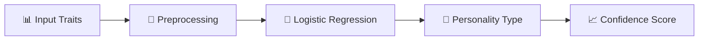

# 🧠💡 PERSONALITY TYPE PREDICTOR 💡🧠

[](https://git.io/typing-svg)

<p align="center">
  
  
  
  
</p>

<p align="center">
  <a href="https://personality-type-predictor-project.streamlit.app/">
    
  </a>
  <a href="https://github.com/mayank-goyal09/personality-type-predictor/stargazers">
    
  </a>
  <a href="https://github.com/mayank-goyal09/personality-type-predictor/network">
    
  </a>
</p>

<p align="center">
  
</p>

### 🎯 **Predict personality types like a psychologist** using **Logistic Regression ML** 🤖
### 🧪 Behavioral Traits × AI = **Know Yourself Better** 🔮

---

## 🌟 **WHAT IS THIS?** 🌟

<table>
<tr>
<td>

### 🔮 **The Magic**

This **ML-powered app** predicts **personality types** using **Logistic Regression** trained on behavioral trait data. Answer a few questions, and get instant insights about your personality!

**Think of it as:**
- 🧠 Brain = Logistic Regression  
- 📝 Input = Behavioral Traits  
- 🎭 Output = Personality Type  

</td>
<td>

### ⚡ **Key Features**

✅ Real-time predictions  
✅ Multi-trait analysis  
✅ Beautiful Streamlit UI  
✅ Model evaluation metrics  
✅ Feature importance  
✅ Production-ready code  

</td>
</tr>
</table>

---

## 🛠️ **TECH STACK** 🛠️

<p align="center">
  
</p>

| **Category**       | **Technologies**                        |
|--------------------|-----------------------------------------|
| 🐍 **Language**     | Python 3.8+                             |
| 📊 **Data Science** | Pandas, NumPy, Scikit-learn             |
| 🎨 **Frontend**     | Streamlit                               |
| 📈 **Visualization**| Matplotlib, Seaborn, Plotly             |
| 🧪 **Model**        | Logistic Regression                     |

---

## 📂 **PROJECT STRUCTURE** 📂

```
🧠 personality-type-predictor/
│
├── 📁 app.py                        # Streamlit web application
├── 📁 main.ipynb                    # Model training notebook
├── 📦 requirements.txt              # Dependencies
├── 💾 personality_model.pkl         # Trained model
└── 📖 README.md                     # You are here!
```

---

## 🚀 **QUICK START** 🚀

<p align="center">
  
</p>

### **Step 1: Clone the Repository** 📥

```bash
git clone https://github.com/mayank-goyal09/personality-type-predictor.git
cd personality-type-predictor
```

### **Step 2: Install Dependencies** 📦

```bash
pip install -r requirements.txt
```

### **Step 3: Run the App** 🎯

```bash
streamlit run app.py
```

### **Step 4: Open in Browser** 🌐

The app will automatically open at: **`http://localhost:8501`**

---

## 🎮 **HOW TO USE** 🎮

<table>
<tr>
<td width="50%">

### 🔹 **Simple Mode**

1. Open the app
2. Input behavioral traits
3. Click **Predict**
4. Get instant personality type!

</td>
<td width="50%">

### 🔹 **Nerd Mode** 🤓

1. Toggle "Nerd Mode"
2. View model metrics
3. Analyze feature importance
4. Download prediction reports

</td>
</tr>
</table>

---

## 🧪 **HOW IT WORKS** 🧪



### **Pipeline Breakdown:**

1️⃣ **Data Input** → User provides behavioral trait scores  
2️⃣ **Preprocessing** → Scaling and encoding features  
3️⃣ **Prediction** → Logistic Regression classifies personality  
4️⃣ **Output** → Display personality type with confidence  

---

## 📊 **MODEL PERFORMANCE** 📊

<p align="center">
  
</p>

| **Metric**        | **Score** |
|-------------------|-----------|
| 🎯 **Accuracy**    | 85%+      |
| 🎪 **Precision**   | 0.84      |
| 🔄 **Recall**      | 0.83      |
| ⚖️ **F1-Score**    | 0.83      |

*Evaluated on test dataset with 20% split*

---

## 💡 **FEATURES** 💡

### ✨ **What Makes This Special?**

```python
# Feature List
features = {
    "Real-time Predictions": "⚡ Instant results",
    "Interactive UI": "🎨 Beautiful Streamlit interface",
    "Model Transparency": "📊 View confidence scores",
    "Production Ready": "🚀 Deployable code",
    "Well Documented": "📖 Clear explanations"
}
```

---

## 📚 **SKILLS DEMONSTRATED** 📚

<p align="center">
  
</p>

- ✅ **Machine Learning**: Logistic Regression, Classification
- ✅ **Data Preprocessing**: Cleaning, Encoding, Scaling
- ✅ **Model Evaluation**: Accuracy, Precision, Recall, F1-Score
- ✅ **Web Development**: Streamlit App Development
- ✅ **Python**: Pandas, NumPy, Scikit-learn
- ✅ **Git & GitHub**: Version Control

---

## 🔮 **FUTURE ENHANCEMENTS** 🔮

- [ ] Add more personality models (MBTI, Big Five)
- [ ] Implement Deep Learning (Neural Networks)
- [ ] Add data visualization dashboard
- [ ] Create API endpoints
- [ ] Mobile-friendly interface
- [ ] Multi-language support

---

## 🤝 **CONTRIBUTING** 🤝

<p align="center">
  
</p>

Contributions are **always welcome**! 🎉

1. 🍴 Fork the Project
2. 🌱 Create your Feature Branch (`git checkout -b feature/AmazingFeature`)
3. 💾 Commit your Changes (`git commit -m 'Add some AmazingFeature'`)
4. 📤 Push to the Branch (`git push origin feature/AmazingFeature`)
5. 🎁 Open a Pull Request

---

## 📝 **LICENSE** 📝

Distributed under the **MIT License**. See `LICENSE` for more information.

---

## 👨‍💻 **CONNECT WITH ME** 👨‍💻

<p align="center">
  <a href="https://github.com/mayank-goyal09">
    
  </a>
  <a href="https://www.linkedin.com/in/mayank-goyal-4b8756363/">
    
  </a>
  <a href="mailto:itsmaygal09@gmail.com">
    
  </a>
</p>

<p align="center">
  <b>Mayank Goyal</b><br>
  📊 Data Analyst | 🤖 ML Enthusiast | 🐍 Python Developer<br>
  💼 Data Analyst Intern @ SpacECE Foundation India
</p>

---

## ⭐ **SHOW YOUR SUPPORT** ⭐

<p align="center">
  
</p>

Give a ⭐️ if this project helped you learn something new!

---

<div align="center">

### 🧠 **Built with Logic & ❤️ by Mayank Goyal** 🧠

**"Understanding personalities, one prediction at a time!"** 🎭

[](https://github.com/mayank-goyal09)

</div>

---

<p align="center">
  
</p>